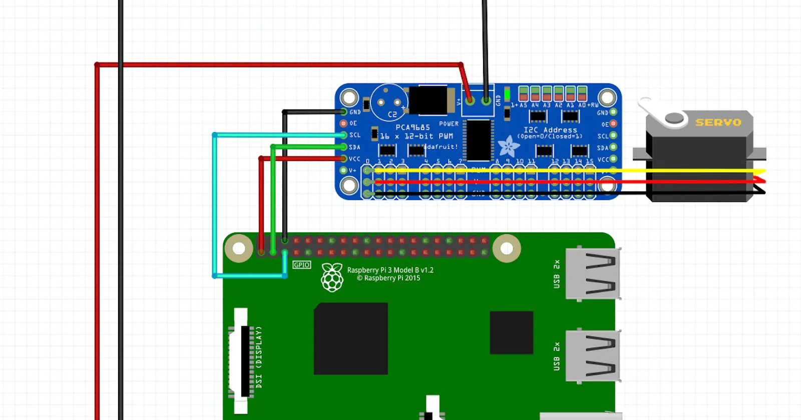

# Ros package for raspi and PCA98 implemented S.P.O.T.

##### Connections 

- raspi gpio pins

#### Chek this blog
[link for the blog](https://blog.garybricks.com/control-16-servos-with-raspberry-pi-pca9685-driver)